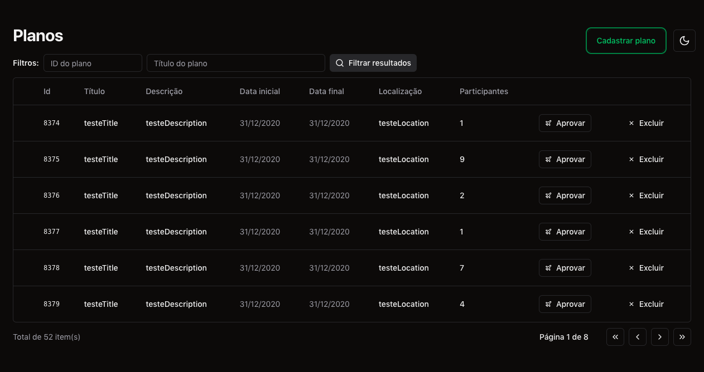
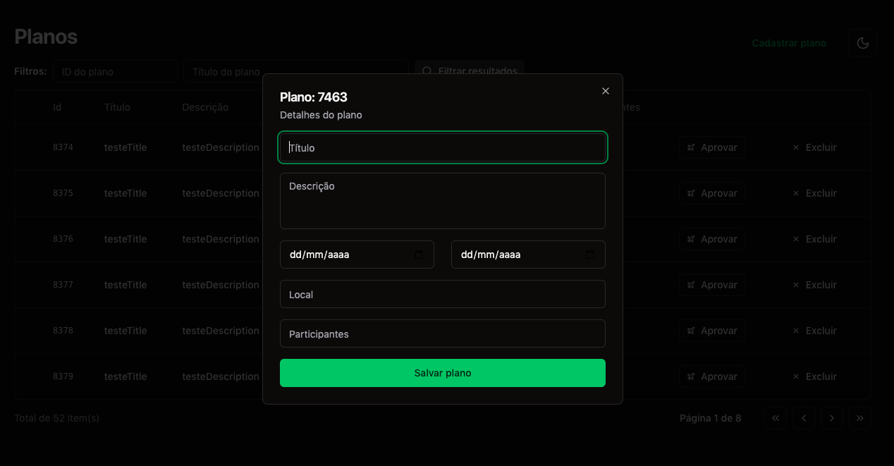

<h1 align="center"> Vacation Planner </h1>

<p align="center"> 
  Um aplicativo que gerencia a lista de planos de férias e permite aos usuários criar, atualizar e excluir planos de férias.
</p>

## Tecnologias Utilizadas

- ReactJS ( HTTP State, URL State )
- TypeScript
- Tailwindcss
- Tailwind Merge
- Shadcn Ui
- Lucide React
- React Helmet Async
- React Router DOM
- React Query
- React Hook Form
- Zod
- Date Fns
- Sonner
- Eslint (simple-import-sort)
- Prettier (prettier-plugin-tailwindcss)
- Vite

## Rodando

Após clonar o repositório, acesse a pasta do projeto e execute os comandos abaixo:

```sh
npm install
npm run dev
```

Acesse http://localhost:5173 para visualizar a aplicação.

<!--START_SECTION:footer-->

---

Desenvolvido 💚 por Vanessa Brazuna

<!--END_SECTION:footer-->

